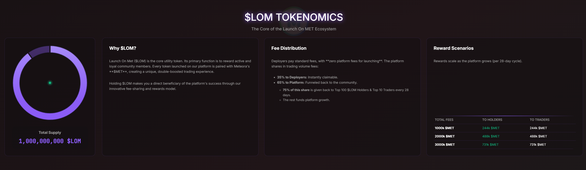
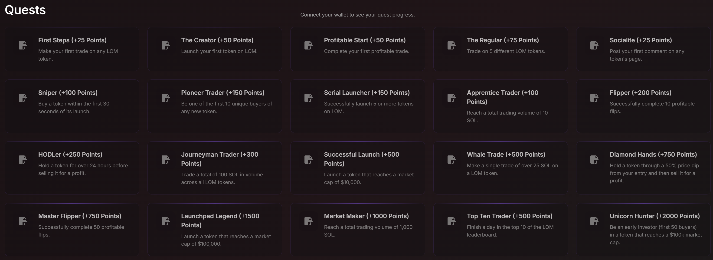

 Launch On MET – Solana's Premier Token Launchpad

  
  
  
  Deploy, Trade, and Earn on Meteora's Dynamic Bonding Curve.
  Zero platform fees, instant launches, gamified rewards, and Jupiter-powered insights. Built for degens who move fast.   

  
  
  
  
    

  <a href="#quick-start"> Get Started</a> • 
  <a href="#features"> Features</a> • 
  <a href="#tech-stack"> Tech</a> • 
  <a href="#contribute"> Contribute</a>

 Why Launch On MET?Tired of ruggy launches and clunky DEXs? Launch On MET is your one-stop Solana pad for fair, fee-sharing token deploys. Pair with MET for boosted liquidity, earn 35% of trading fees as creator, and climb leaderboards with quests. Utility-driven: Hold $LOM for platform rewards.Fair & Transparent: DBC curves prevent dumps; no presales.
Utility-First: $LOM holders get 75% of platform cuts monthly.
Degen-Friendly: Quick buys, live charts, comment threads.

  

 Quick StartPrerequisitesNode.js ≥18
A Solana wallet (e.g., Phantom) for testing
Pinata account (free tier OK) for IPFS

Step 1: Clone & Installbash

git clone https://github.com/LaunchOnMET/LOM.git
cd launch-on-met
npm install

Step 2: Configure SecretsCreate .env:env

WALLET_SECRET=your_base58_encoded_private_key_here  # Platform fee wallet
PINATA_JWT=your_pinata_jwt_here                    # IPFS uploads
PORT=3000

Wallet: Generate via solana-keygen new → Base58 encode the array.
Pinata: Sign up → API Keys → JWT.

Step 3: Prep Assetsconfigs.json: Meteora blueprints (e.g., SOL/USDC pairs). Example (configs.example.json)
./vanity/: Drop JSON keypairs for mints (generate 100+ for prod).
banner.png: Your repo header (1200x400px recommended).

Step 4: Launch!bash

npm start  # Or: node server.js

Visit http://localhost:3000 → Connect wallet → Deploy your first token! Deploy to ProductionRender: Connect GitHub → Set env vars → Deploy (free hobby tier).
Vercel: vercel --prod (static + serverless functions).
Custom: PM2 for uptime, NGINX for SSL.

  

 Core Features1. Instant Launches Custom metadata (name/symbol/desc/image) → IPFS via Pinata.
Pair with SOL/USDC/USD1/MET; optional initial buy.
Vanity mints from pre-gen keypairs—unique & gas-efficient.

2. Live Dashboard Filter: All/Trending/Graduated.
Cards: MCAP, curve progress, quick buy/copy/fav.
Top tokens marquee + markets table (MCAP/Vol/Holders).

3. Token Insights Charts: Price history (Chart.js), bonding curve.
Txs: Real-time buys/sells via Jupiter.
Social: Comments, shares (X/DexScreener).

4. Gamification Quests: "First Launch" (+10pts), "Whale Trade" (+50pts).
Leaderboards: Top traders/deployers.
Rewards: $LOM airdrops to holders.

5. Creator Tools My Tokens: Track deploys, claim 35% fees.
Portfolio: PnL, win rate, holdings overview.

  

 Tech StackLayer
Tech
Why?
Backend
Express.js + LowDB
Lightweight API + JSON persistence (no SQL hassle)
Blockchain
Solana Web3.js + Meteora DBC SDK
Fair launches, instant pools
Data/Integrations
Jupiter API + Pinata IPFS
Real-time prices/swaps + decentralized storage
Real-Time
WebSockets (ws)
Live comments/chats per token
Frontend
Vanilla JS + Chart.js/Lightweight Charts
No bloat—fast, customizable
Utils
dotenv, Multer, bs58, BN.js
Env/secrets, uploads, keys/math

Pro Tip: Cache Jupiter calls (2min TTL) to slash API costs. Scale DB to Postgres for 10K+ users. Customization GuideAdd a New Quote PairEdit configs.json: { "SOL": "config_pubkey_here" }.
Update frontend dropdown in index.html.

New Quests./quests.json: Add { "id": "NEW_QUEST", "title": "Epic Flip", "points": 100 }.
Auto-awards in processNewTradesForQuests().

Theme TweaksCSS vars in <style>: --accent: #your-color;.
Dark/Light mode toggle via data-theme="light".

 ContributingFork & Clone  bash

git clone your-fork-url
cd launch-on-met
npm i

Branch & Commit  bash

git checkout -b feat/your-idea
git commit -m "feat: Add XYZ"
git push origin feat/your-idea

PR Tips  Test on devnet: Swap RPC to devnet.solana.com.  
Update README: Add your feature to Features.  
Linting: npm run lint (ESLint included).

Code of Conduct: Be kind, Solana-focused. Issues? Open one.

  

 Stats & RoadmapMetric
Value
Goal
Tokens Launched
500+
10K by EOY
Daily Volume
$50K
$1M
Active Users
1K
50K

Roadmap:  Q4 2025: NFT support, mobile app.  
Q1 2026: Cross-chain (ETH/Base), AI quest gen.  
Always: Audit + security bounties.

 Disclaimer & LicenseDYOR: Not financial advice. Solana txs can fail—use testnet first. No liability for losses.License: MIT © 2025 Launch On MET Team. LICENSE

  **Launch on MET—Where Degens Meet Destiny.**   
  

  <a href="https://x.com/LaunchonMet"> Follow on X</a> • 

Powered by Solana, Meteora, & Jupiter. Made with  for the ecosystem.

